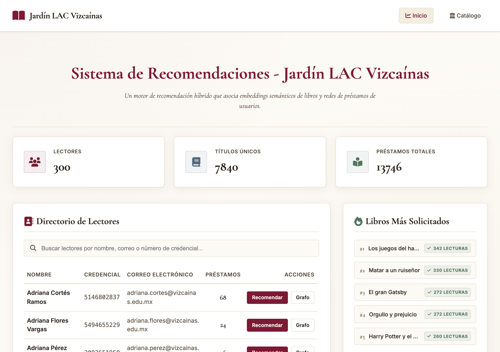
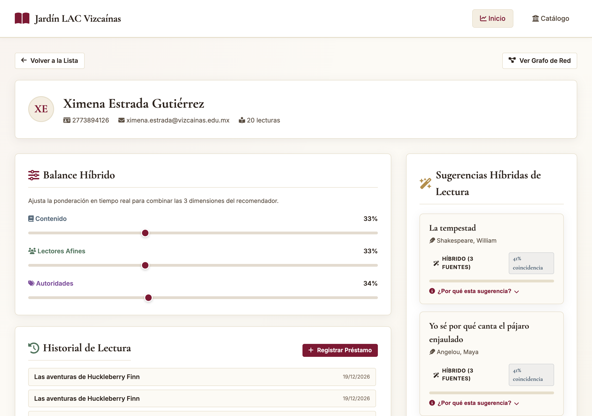
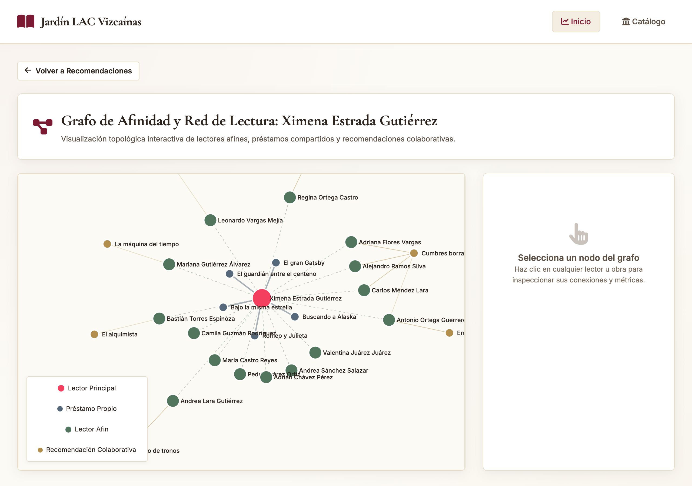
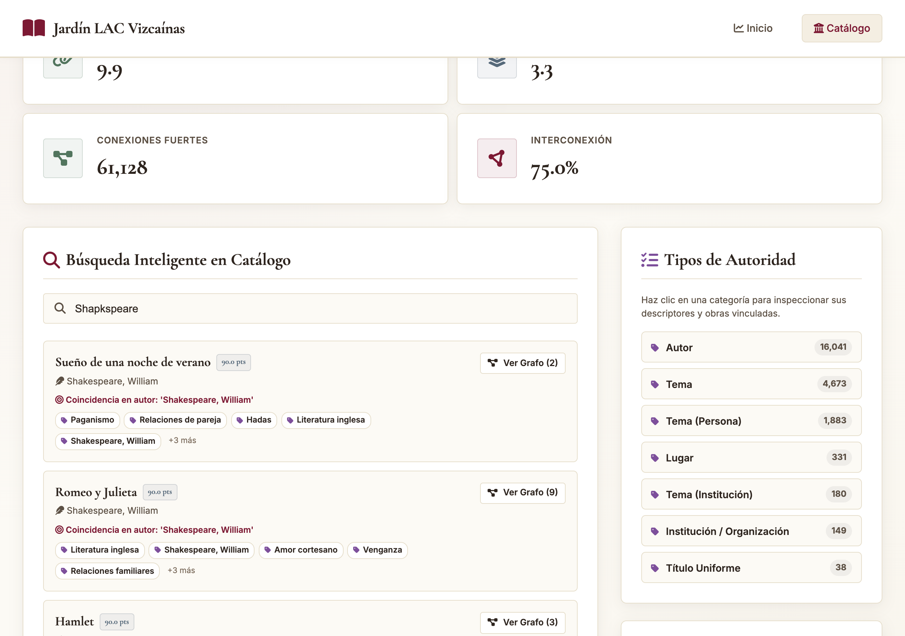
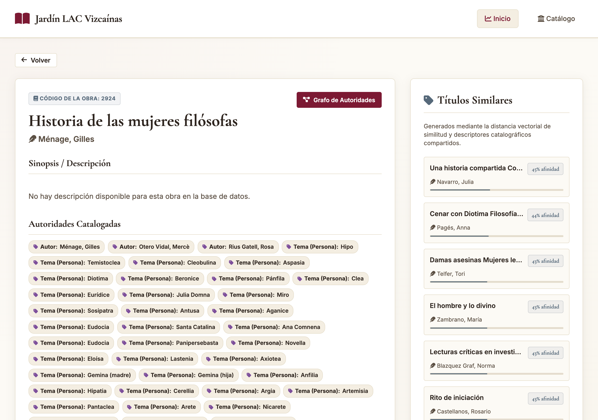
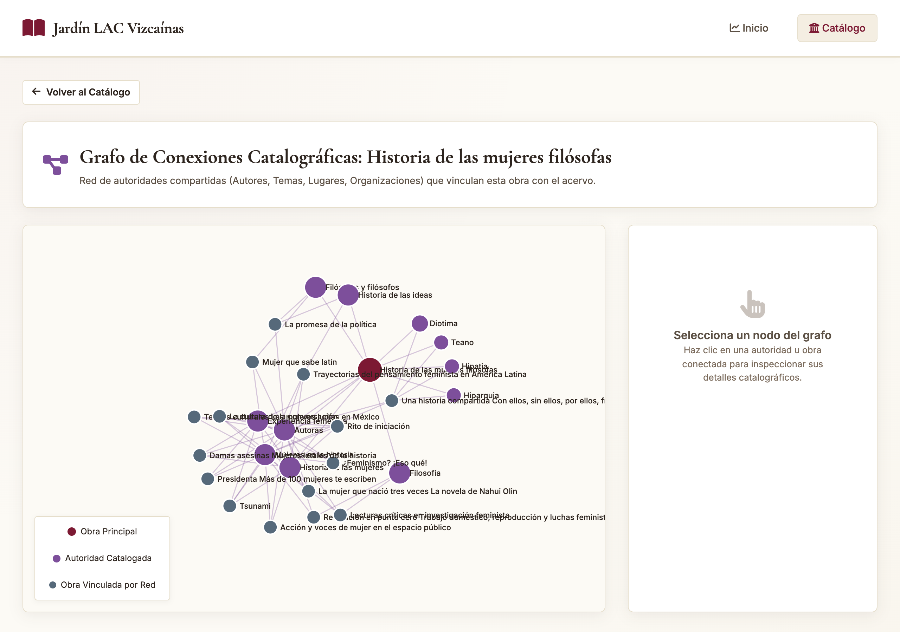

# 📖 Jardín LAC Vizcaínas — Sistema de Recomendaciones y Catálogo Inteligente

Un sistema integral de recomendaciones de lectura híbridas y exploración bibliográfica en red desarrollado para la biblioteca **Jardín LAC**. El sistema combina análisis de datos avanzado en Python (procesamiento de registros catalográficos MARC21 de Koha ILS, incrustaciones semánticas con sentence-transformers, filtrado colaborativo con distancia de Jaccard y grafos de autoridades) con una plataforma web en **Ruby on Rails 8** orientada a la experiencia de usuario (Hotwire Turbo, Stimulus JS y visualizaciones interactivas D3.js).

---

## 📸 Capturas de Pantalla de la Aplicación

| Panel de Inicio y Directorio de Lectores | Perfil del Lector y Recomendaciones Híbridas |
| :---: | :---: |
|  |  |
| *Búsqueda en tiempo real y directorio de lectores con estadísticas de préstamos.* | *Deslizadores interactivos de ponderación (Contenido, Lectores Afines, Autoridades).* |

| Grafo Interactivo de Afinidad entre Lectores | Búsqueda Inteligente en Catálogo (Búsqueda Difusa con Errores) |
| :---: | :---: |
|  |  |
| *Física de fuerza dirigida D3.js conectando lectores y obras afines.* | *Búsqueda inteligente con tolerancia a errores tipográficos (ej. "Shapkspeare" ➔ William Shakespeare).* |

| Detalle de Obra e Inspector de Similitud | Red de Autoridades Catalográficas (Historia de las Mujeres Filósofas) |
| :---: | :---: |
|  |  |
| *Motor de similitud en 2 niveles (Embeddings Semánticos y Autoridades compartidas).* | *Red interconectada de autoridades (autores, materias, periodos) y obras vinculadas.* |

---

## 📋 Tabla de Contenidos

- [🏛 Contexto y Objetivos](#-contexto-y-objetivos)
- [🏗 Arquitectura General del Sistema](#-arquitectura-general-del-sistema)
- [🐍 Pipeline de Análisis de Datos (Python)](#-pipeline-de-análisis-de-datos-python)
  - [1. Extracción del Catálogo Koha ILS](#1-extracción-del-catálogo-koha-ils)
  - [2. Enriquecimiento con Datos de Goodreads](#2-enriquecimiento-con-datos-de-goodreads)
  - [3. Matriz de Similitud Semántica (sentence-transformers + Coseno)](#3-matriz-de-similitud-semántica-sentence-transformers--coseno)
  - [4. Filtrado Colaborativo de Lectores (Índice de Jaccard)](#4-filtrado-colaborativo-de-lectores-índice-de-jaccard)
  - [5. Red y Grafo de Autoridades Catalográficas (MARC21)](#5-red-y-grafo-de-autoridades-catalográficas-marc21)
- [💎 Aplicación Web (Ruby on Rails 8)](#-aplicación-web-ruby-on-rails-8)
  - [Stack Tecnológico](#stack-tecnológico)
  - [Modelo de Datos y Esquema de Base de Datos](#modelo-de-datos-y-esquema-de-base-de-datos)
  - [Motor de Recomendación Híbrido (RecommendationService)](#motor-de-recomendación-híbrido-recommendationservice)
  - [Motor de Similitud de 2 Niveles para Obras (BooksController)](#motor-de-similitud-de-2-niveles-para-obras-bookscontroller)
  - [Visualizaciones Interactivas D3.js](#visualizaciones-interactivas-d3js)
- [🎨 Diseño, Accesibilidad (a11y) y UX](#-diseño-accesibilidad-a11y-y-ux)
- [🔄 Ingesta de Datos e Idempotencia (Rake Tasks)](#-ingesta-de-datos-e-idempotencia-rake-tasks)
- [🚀 Guía de Instalación y Desarrollo Local](#-guía-de-instalación-y-desarrollo-local)
- [🧪 Pruebas, Calidad de Código y Seguridad](#-pruebas-calidad-de-código-y-seguridad)
- [☁️ Despliegue en Render e Integración Continua (CI/CD)](#️-despliegue-en-render-e-integración-continua-cicd)

---

## 🏛 Contexto y Objetivos

Para enriquecer la experiencia de los lectores e investigadores y facilitar la navegación por su acervo, este proyecto resuelve dos necesidades centrales:

1. **Recomendaciones Personalizadas de Lectura**: Superar las búsquedas por palabra clave tradicional mediante un algoritmo híbrido que combina la **temática de los libros**, la **afinidad entre hábitos de lectura de distintos usuarios** y los **descriptores de autoridad catalográfica** (autores, materias, lugares, periodos).
2. **Visualización Exploratoria de Redes**: Permitir a usuarios y bibliotecarios navegar visualmente por las interconexiones entre obras, autores y descriptores a través de grafos interactivos.

---

## 🏗 Arquitectura General del Sistema

El proyecto está diseñado bajo una arquitectura limpia en dos capas acopladas mediante artefactos de datos normalizados en JSON/CSV:

```
┌─────────────────────────────────────────────────────────────────────────┐
│                    CAPA DE ANÁLISIS DE DATOS (PYTHON)                    │
│                                                                         │
│  Extracción Koha ──► Mapping Goodreads ──► Embeddings Semánticos & Coseno   │
│         │                                        │                      │
│         ▼                                        ▼                      │
│  Selección Lectores ──► Jaccard Colaborativo ──► Grafo Autoridades MARC │
└────────────────────────────────────┬────────────────────────────────────┘
                                     │ Generación de JSONs / CSV
                                     ▼
┌─────────────────────────────────────────────────────────────────────────┐
│                 CAPA DE APLICACIÓN WEB (RUBY ON RAILS 8)                │
│                                                                         │
│  rake import:all ──► Base de Datos SQLite ──► Engine Recomendador       │
│                                                       │                 │
│  D3.js Network Graphs ◄── Turbo / Stimulus UI ◄───────┴─────────────────┤
└─────────────────────────────────────────────────────────────────────────┘
```

---

## 🐍 Pipeline de Análisis de Datos (Python)

Toda la lógica de procesamiento masivo de datos se ejecuta en Python (`pipeline/`), generando los datasets precalculados consumidos por la aplicación web.

### 1. Extracción del Catálogo Koha ILS

- **Script**: `pipeline/fetch_koha_catalog.py`
- Extrae registros bibliográficos del sistema Koha ILS en formato MARC21.
- Estructura campos clave:
  - `100 / 700`: Autorías principales y secundarias.
  - `600 / 610 / 650 / 651 / 655`: Descriptores temáticos, corporativos, geográficos y de forma/género.

### 2. Enriquecimiento con Datos de Goodreads

- **Script**: `pipeline/match_koha_goodreads.py`
- Mapea obras del catálogo local con registros de Goodreads para enriquecer descripciones, portadas y métricas globales de popularidad.

### 3. Matriz de Similitud Semántica (sentence-transformers + Coseno)

- **Script**: `pipeline/embed_books.py`
- Construye vectores de caracterización para cada obra procesando títulos, sinopsis y descriptores catalográficos mediante el modelo **`all-MiniLM-L6-v2` de sentence-transformers** (384 dimensiones, multilingüe).
- Calcula la **Similitud Coseno** entre todos los pares de libros:
  $$\text{SimilitudCoseno}(A, B) = \frac{A \cdot B}{\|A\| \|B\|}$$
- Produce **24,500 pares de similitud temática** almacenados en `data/content_similarities.json`.

### 4. Filtrado Colaborativo de Lectores (Índice de Jaccard)

- **Scripts**: `pipeline/select_koha_users.py`, `pipeline/generate_recommendations.py`
- Procesa el historial de préstamos (`data/koha_checkouts.csv`) de 300 lectores representativos (13,746 préstamos).
- Calcula la **Similitud de Jaccard** entre el conjunto de lecturas de dos usuarios $U_1$ y $U_2$:
  $$J(U_1, U_2) = \frac{|U_1 \cap U_2|}{|U_1 \cup U_2|}$$
- Produce **9,000 pares de afinidad de lectores** en `data/collab_recommendations.json` y `data/user_graph.json`.

### 5. Red y Grafo de Autoridades Catalográficas (MARC21)

- **Script**: `pipeline/build_authority_graph.py`
- Modela las relaciones entre libros basándose en autoridades compartidas (mismo autor, temática, periodo histórico o lugar de publicación).
- Genera **23,295 autoridades catalográficas** y **61,128 conexiones inter-libro** en `data/koha/authority_graph.json`.

---

## 💎 Aplicación Web (Ruby on Rails 8)

La aplicación web en Rails 8 provee una interfaz ágil, reactiva y responsive para explotar el motor de recomendaciones y explorar el acervo.

### Stack Tecnológico

- **Framework**: Ruby on Rails `8.1.3.1` (Ruby `3.4.9`)
- **Base de Datos**: SQLite 3 (`storage/production.sqlite3` en producción)
- **Frontend Reactive**: Hotwire (Turbo Frames & Turbo Streams + Stimulus JS v3)
- **Visualización de Grafos**: D3.js v7 (Fuerza dirigida en SVG / Canvas)
- **Estilos**: CSS Vanilla con variables de diseño académico (OKLCH color system)

### Modelo de Datos y Esquema de Base de Datos

```
  ┌───────────┐         ┌───────────┐         ┌──────────────┐
  │  Patron   │1       *│ Checkout  │*       1│     Book     │
  │ (Lector)  ├─────────┤ (Préstamo)├─────────┤   (Libro)    │
  └─────┬─────┘         └───────────┘         └──────┬───────┘
        │                                            │
        │1                                           │1
        ▼*                                           ▼*
┌──────────────────┐                     ┌──────────────────────┐
│ UserSimilarity   │                     │ ContentSimilarity    │
│(Jaccard Lectores)│                     │(Embeddings Semánticos)     │
└──────────────────┘                     └──────────────────────┘
                                                     │
                                                     │1
                                                     ▼*
┌─────────────┐1       *┌─────────────────┐*        *│ BookConnection       │
│  Authority  ├─────────┤ BookAuthority   ├──────────┤(Conexión Autoridad)  │
│ (MARC21 Tag)│         │(Relación Libro) │          └──────────────────────┘
└─────────────┘         └─────────────────┘
```

1. **`Book`**: Registro bibliográfico (título, autor, sinopsis).
2. **`Patron`**: Usuario o lector del sistema (nombre, credencial, correo).
3. **`Checkout`**: Historial de préstamos (registra préstamos históricos e interacciones simuladas en vivo).
4. **`Authority`**: Entidad de autoridad MARC21 (autores, materias, lugares, periodos).
5. **`BookAuthority`**: Tabla de unión entre obras y sus descriptores.
6. **`BookConnection`**: Ponderación de conexiones entre dos libros basada en autoridades compartidas.
7. **`ContentSimilarity`**: Par de similitud temática precalculada entre dos libros (0.0 a 1.0).
8. **`UserSimilarity`**: Par de similitud de comportamiento entre dos lectores (0.0 a 1.0).

---

### Motor de Recomendación Híbrido (`RecommendationService`)

El servicio `RecommendationService` calcula recomendaciones personalizadas en tiempo real para cualquier lector según un balance dinámico entre las tres dimensiones del sistema:

$$S_{\text{final}}(B) = w_{\text{content}} \cdot \hat{S}_{\text{content}}(B) + w_{\text{collab}} \cdot \hat{S}_{\text{collab}}(B) + w_{\text{auth}} \cdot \hat{S}_{\text{auth}}(B)$$

Donde:

- $\hat{S}_{\text{content}}(B)$: Similitud acumulada de contenido (embeddings semánticos) entre la obra $B$ y las obras leídas por el usuario.
- $\hat{S}_{\text{collab}}(B)$: Puntuación colaborativa obtenida de los hábitos de lectores afines (distancia Jaccard).
- $\hat{S}_{\text{auth}}(B)$: Similitud estructural por autoridades compartidas (autores y materias comunes).
- Los pesos $w_{\text{content}}, w_{\text{collab}}, w_{\text{auth}}$ se pueden ajustar dinámicamente mediante los deslizadores interactivos en la vista del lector.

---

### Motor de Similitud de 2 Niveles para Obras (`BooksController`)

Al visualizar el detalle de un libro (`/books/:id`), el controlador implementa un motor de similitud en 2 niveles:

1. **Nivel Primario**: Recupera las obras con mayor similitud semántica desde `ContentSimilarity`.
2. **Nivel Secundario (Fallback)**: Para obras sin vectores precalculados, ejecuta una consulta relacional optimizada que agrupa libros por el número máximo de autoridades catalográficas compartidas (`BookAuthority`), garantizando que **todas las obras del catálogo presenten sugerencias afines**.

---

### Visualizaciones Interactivas D3.js

La aplicación ofrece dos vistas de red con física de fuerza dirigida (D3.js v7):

1. **Grafo de Afinidad de Lectores (`/users/:id/graph`)**:
   - Muestra el lector actual al centro conectado con sus lectores afines (nodos dorados) y los libros que estos han disfrutado (nodos borgoña).
   - Incluye un panel lateral inspector que detalla las obras leídas e historial de préstamos al seleccionar cualquier nodo.

2. **Grafo de Autoridades Catalográficas (`/catalog/graph/:id`)**:
   - Visualiza la obra seleccionada rodeada de sus descriptores catalográficos (autores, materias, lugares) y otras obras conectadas.
   - Permite alternar la visibilidad de autoridades y filtrar tipos de nodos.

---

## 🎨 Diseño, Accesibilidad (a11y) y UX

La interfaz cumple estrictos criterios de accesibilidad (WCAG AA) y estándares de diseño editorial académico:

- **Tipografía**: Combinación de *Cormorant Garamond* para encabezados con *Inter* para datos legibles.
- **Paleta de Color**: Tonos institucionales académicos (`--color-accent: #7c1933` borgoña, `--color-gold: #b38f4d` dorado).
- **Indicadores de Foco**: Anillos `:focus-visible` de alto contraste para navegación por teclado.
- **Etiquetas Accesibles**: Etiquetas `.sr-only` y atributos `aria-label` en todas las barras de búsqueda y controles deslizantes.
- **Hit Targets Móviles**: Botones y elementos interactivos con altura mínima de `44px` en pantallas móviles.
- **Zoom Preventivo**: Tamaño de fuente de `16px` en campos de texto móviles para evitar auto-zoom desorientador en iOS Safari.

---

## 🔄 Ingesta de Datos e Idempotencia (Rake Tasks)

El proceso de población de datos se ejecuta de forma completamente **idempotente** mediante Rake tasks:

```bash
# Ingesta completa de todo el acervo, lectores, historial y matrices de similitud
bin/rails import:all
```

Esta tarea ejecuta secuencialmente:

1. `import:books`: Carga 7,840 obras bibliográficas desde `data/book_metadata.json`.
2. `import:patrons`: Carga 300 lectores desde `data/patron_names.json`.
3. `import:checkouts`: Registra 13,746 préstamos históricos desde `data/koha_checkouts.csv`.
4. `import:authorities`: Carga 23,295 autoridades y 77,812 relaciones `BookAuthority` desde `data/koha/authority_graph.json`.
5. `import:connections`: Carga 61,128 conexiones inter-libro por autoridades.
6. `import:content_similarities`: Carga 24,500 pares de similitud temática.
7. `import:user_similarities`: Carga 9,000 pares de similitud entre lectores.
8. `import:embeddings`: Carga los **7,840 vectores semánticos de 384 dimensiones** (uno por libro) generados por la pipeline de embeddings, persistidos como `BLOB` en `books.embedding`.

---

## 🧠 Búsqueda Semántica en Tiempo Real

Además de la búsqueda por coincidencia literal (token + Levenshtein), el catálogo soporta **búsqueda semántica** que permite consultas por tema aunque el término exacto no aparezca en el título, autor o autoridad. Por ejemplo, una consulta como *"soledad existencial"* devuelve *Steppenwolf* (Hermann Hesse) porque su descripción conecta temáticamente con la búsqueda, aunque la palabra "soledad" no aparezca en el libro.

### Arquitectura

```
  pipeline/embed_books.py                ONNX Runtime (C++)
       │                                      ▲
       │ genera                                │
       ▼                                      │  infiere
  data/embeddings.bin  ──► import:embeddings ──► books.embedding (BLOB)
  data/embeddings_index.json                                            │
                                                                       │ QueryEmbedder
  data/mini_lm_onnx/  ────────────────────────────────────► (onnxruntime) ◄┘
       ▲                                                   ▲
       │                                                   │
  pipeline/export_onnx.py                          Rails request
  (one-time, offline)                              (CatalogController#search)
```

- **Pipeline offline (Python + sentence-transformers)**: `pipeline/embed_books.py` produce el vector semántico (384 dims, L2-normalizado) para cada libro del catálogo Koha. Se ejecuta en una laptop o CI — **nunca en Render**.
- **Export one-time a ONNX**: `pipeline/export_onnx.py` convierte los pesos PyTorch a un artefacto ONNX int8-quantized en `data/mini_lm_onnx/` (~22 MB). Este directorio se commitea al repo y **nunca se vuelve a regenerar** salvo que cambie la versión del modelo.
- **Inferencia en runtime (Ruby + ONNX)**: la gema `onnxruntime` carga el modelo ONNX y la gema `tokenizers` produce los mismos tokens que el pipeline Python. `app/services/query_embedder.rb` codifica el query del usuario en el mismo espacio vectorial.
- **Almacenamiento**: cada libro guarda su vector como `BLOB` de 1.5 KB en `books.embedding`. Para 7,840 obras son ~12 MB — pequeño suficiente para cargar toda la columna en memoria durante la búsqueda.

### Híbrido token + semántico

`CatalogSearchService` ahora combina ambas señales con un peso configurable:

```
final_score = (1 - w_semantic) · token_score + w_semantic · semantic_score
```

donde `w_semantic = 0.35` por default (ligero sesgo hacia la coincidencia literal para que las erratas tipográficas sigan ganando). Los libros sin embedding se evalúan sólo con el score token, preservando el comportamiento legacy.

### Despliegue en Render (Free Tier)

- **Sin Python en runtime**: el modelo ONNX corre en C++ dentro de la gema `onnxruntime`, no se necesita buildpack de Python.
- **Memoria**: ~80 MB de footprint para el modelo + runtime. Cabe holgadamente en los 512 MB del tier gratuito.
- **Latencia**: ~300 ms en la primera búsqueda (carga del modelo), 20–40 ms por query subsecuente.
- **`bin/render-build.sh`** pre-calienta el modelo durante el deploy para que la primera búsqueda del usuario no pague el costo de carga.

### Regenerar el modelo

Si en el futuro cambias la versión de `all-MiniLM-L6-v2`, ejecuta en tu laptop:

```bash
pip install 'optimum[onnxruntime]' onnx
SENTENCE_TRANSFORMER_REVISION=<nuevo-sha> python3 pipeline/export_onnx.py
git add data/mini_lm_onnx/ data/embeddings.bin data/embeddings_index.json
git commit -m "chore: refresh MiniLM ONNX export to revision <sha>"
bin/rails import:embeddings   # repopula books.embedding
```

---

## 🚀 Guía de Instalación y Desarrollo Local

### Requisitos Previos

- **Ruby**: `>= 3.4.0`
- **Rails**: `8.1.3.1`
- **SQLite3**: `>= 3.35.0`
- **Node.js**: `>= 18.0.0` (para scripts de auditoría y capturas opcionales)
- **Python 3** (opcional, solo para regenerar la pipeline de datos o el modelo ONNX)

### Pasos de Instalación

1. **Clonar el repositorio y acceder al directorio**:

   ```bash
   git clone git@github.com:lander16/jardin-lac-vizcainas-recs.git
   cd jardin-lac-vizcainas-recs
   ```

2. **Instalar gemas de Ruby**:

   ```bash
   bundle install
   ```

3. **Crear e inicializar la base de datos**:

   ```bash
   bin/rails db:prepare
   ```

4. **Poblar la base de datos con el dataset completo**:

   ```bash
   bin/rails import:all
   ```

5. **Iniciar el servidor de desarrollo**:

   ```bash
   bin/rails server
   ```

   Navega en tu navegador a `http://localhost:3000`.

---

## 🧪 Pruebas, Calidad de Código y Seguridad

El proyecto cuenta con un suite completo de pruebas unitarias e integración, así como herramientas estáticas de análisis de código:

### Ejecutar Suite de Pruebas

```bash
bundle exec rails test
```

### Análisis Estático de Código (RuboCop)

```bash
bin/rubocop
```

### Auditoría de Seguridad de Vulnerabilidades en Rails (Brakeman)

```bash
bin/brakeman --no-pager
```

### Auditoría de Vulnerabilidades en Gemas (Bundler Audit)

```bash
bin/bundler-audit check --update
```

---

## ☁️ Despliegue en Render e Integración Continua (CI/CD)

### GitHub Actions (CI)

Cada `push` o `pull_request` a las ramas `main` y `rails-migration` desencadena la ejecución automática de la suite de CI (`.github/workflows/ci.yml`):

- Verificación de formato y linters (`RuboCop`).
- Auditoría de seguridad de código (`Brakeman`).
- Escaneo de vulnerabilidades en dependencias (`bundler-audit`).
- Ejecución de pruebas automatizadas (`rails test`).

### Despliegue en Render (Tier Gratuito)

El archivo `render.yaml` y el script `bin/render-build.sh` están optimizados para el plan gratuito de Render:

- **Base de Datos**: Almacenada en `storage/production.sqlite3`.
- **Precompilación de Assets**: Invocada durante el build mediante `bundle exec rails assets:precompile`.
- **Preparación de BD**: Invocada automáticamente en el arranque mediante `bundle exec rails db:prepare`.
